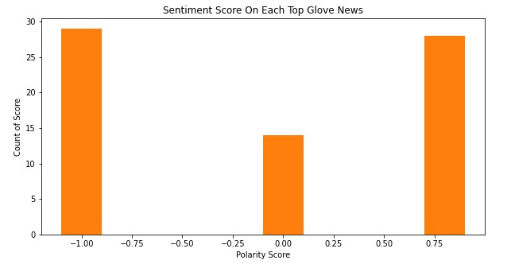
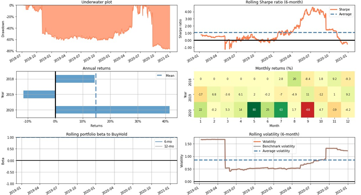
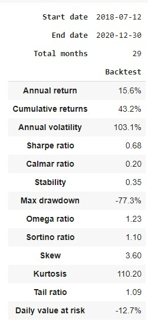
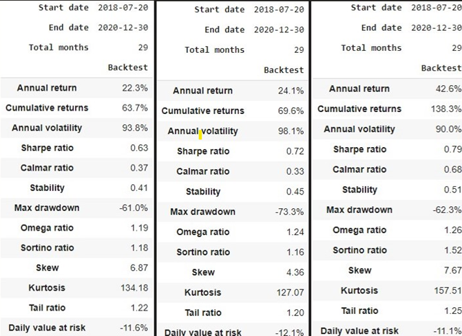
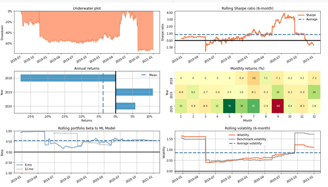
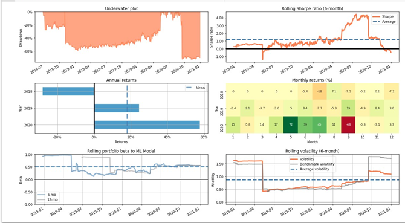
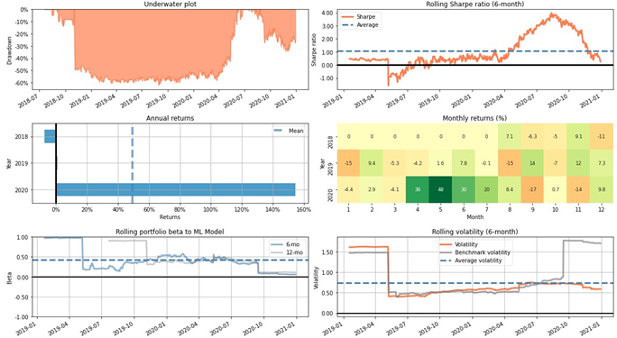
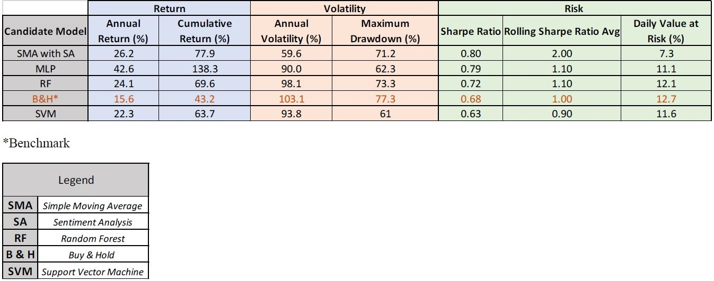

# Capstone_Project_APU
Sentiment analysis & machine learning model to predict stock movement. Experiment with various technique to generate trading signal such as hybrid Simple Moving Average combine with sentiment analysis and 5 machine learning technique (Logistic Regression, Naive Bayes, SVM, Random Forest & MLP). Dataset was mining using web scraping technique & API.

##Webscraping

## Baseline Benchmark (Buy & Hold Strategy)

## Simple Moving Average + Sentiment Analysis Model 

## Machine Learning Model

### Support Vector Machine

### Random Forest

### Multi Layer Perceptron

  ##Result 
 0.80 Sharpe Ratio on SMA & Sentiment Analysis | 26.2% Annual Return
 0.79 Sharpe Ratio on MLP Model | 42.6% Annual Return   

